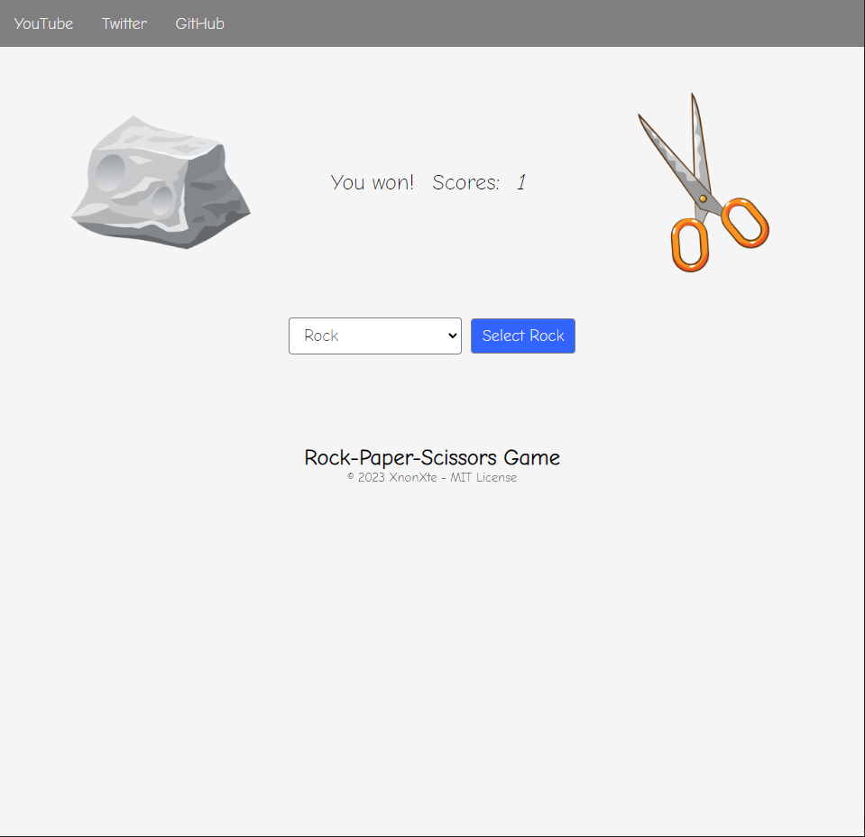

# Rock-Paper-Scissors Game

A simple, fancy, kinda cartoony website created with vanilla JavaScript. You can play this game if you're bored!

## How-to-install

Since this is just a simple website written with vanilla JavaScript, you can host it with a plethora of option. One way you can do it is with using [live-server](https://github.com/ritwickdey/vscode-live-server) on VSCode to host it locally.

## Credit

- [rock-paper-scissors-game.com](https://www.rock-paper-scissors-game.com/) - For the website idea and design.
